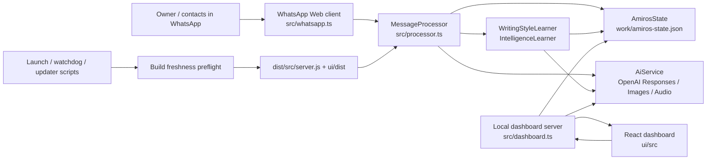
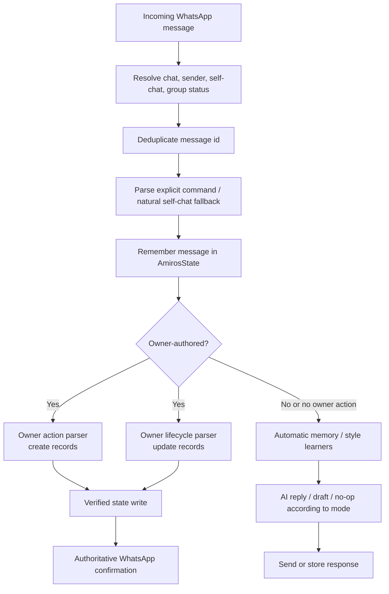
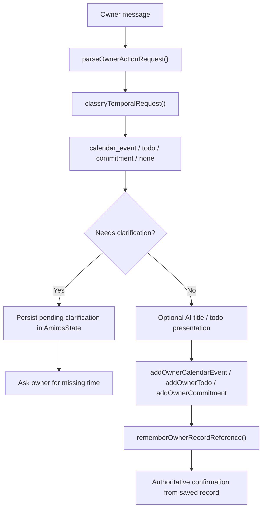
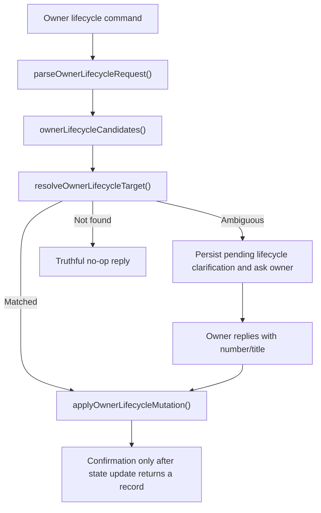

# AmirOS Architecture

Last reviewed: 2026-08-12

AmirOS is a local-first personal assistant that connects to WhatsApp, stores relationship and owner data on the user’s Mac, and exposes a local dashboard at `http://127.0.0.1:3789`.

The system is intentionally built around a few strong principles:

- Deterministic code owns actions that mutate AmirOS state.
- AI enriches, summarizes, ranks, and extracts; it does not get to pretend a write succeeded.
- Long-term memory is canonical, evidence-backed, and preserved even when current truth changes.
- The dashboard is a projection of local state, not a second source of truth.
- Owner-facing intelligence uses shared capability services across the dashboard and WhatsApp; the bot is AmirOS on the go, not a separate assistant with weaker rules.
- Build freshness is part of runtime correctness.

This document describes the architecture that exists today, not an aspirational rewrite.

## System at a glance



## Runtime lifecycle

The production runtime starts from compiled JavaScript, not directly from TypeScript.

Main launch path:

1. `scripts/start-backend.mjs`
   - Verifies backend build freshness.
   - Verifies dashboard UI build freshness.
   - Imports the compiled backend entrypoint.

2. `dist/src/server.js` compiled from `src/server.ts`
   - Loads `.env.local` / `.env` via `loadConfig()`.
   - Creates `AmirosState`.
   - Applies persisted dashboard settings over environment defaults where appropriate.
   - Creates `AiService` with local model and monthly spend controls.
   - Creates `WritingStyleLearner`.
   - Creates `IntelligenceLearner`.
   - Creates `MessageProcessor`.
   - Creates the WhatsApp Web client.
   - Starts the local dashboard server.

3. `scripts/amiros-watchdog.mjs`
   - Runs the same backend and UI freshness preflight before launching the backend.
   - Watches dashboard health.
   - Watches WhatsApp readiness without treating QR / relink states as restart-worthy failures.
   - Handles dashboard-triggered restart requests.
   - Attempts to release stale WhatsApp browser-session locks before restart.

Important invariant: if `src` or `ui/src` is newer than the compiled outputs, AmirOS should rebuild or block startup with an actionable error instead of silently running stale code.

## Persistence model

`src/amiros-state.ts` is the central durable state boundary.

By default it persists to:

```text
work/amiros-state.json
```

The state file contains:

- connection status
- settings and model preferences
- owner profile
- contact preferences
- conversation memory
- manual contact memory
- canonical relationship insights
- commitments
- to-dos
- calendar events
- generated contact profiles
- pending owner-action clarifications
- pending owner-lifecycle clarifications
- recent owner record references
- cached reply-needed assessments
- intelligence question history
- dashboard activity
- usage / spend accounting

The project deliberately keeps this as a local JSON store rather than a remote database. That fits the current single-user local product, but it also means `AmirosState` is a high-coupling module and should be modified carefully.

Supporting local storage:

- `work/whatsapp-qr.png` stores the current QR image.
- `work/timezone-backgrounds/` stores generated city background images.
- `work/todays-focus-icons/` stores generated Today’s Focus icons.
- `work/calendar-feed-token` stores the local calendar subscription token.
- `.env.local` stores the OpenAI API key and local environment overrides.
- `.wwebjs_auth/` stores the WhatsApp linked-device session unless overridden.

## WhatsApp integration

WhatsApp integration lives in `src/whatsapp.ts` and uses `whatsapp-web.js` with `LocalAuth`.

Responsibilities:

- launch a headless WhatsApp Web session
- maintain the linked-device session
- generate and save QR codes for relinking
- identify self-chat messages using known owner WhatsApp IDs
- recover from disconnects
- inspect the real browser session health
- dispatch messages into `MessageProcessor`

AmirOS treats WhatsApp as the transport layer. The durable product state lives in `AmirosState`, not inside WhatsApp.

Important caution: WhatsApp Web internals are used in a few dashboard operations, especially historical media, replies, reactions, and cached chat access. Those paths are powerful but brittle because they depend on WhatsApp Web’s private runtime modules.

## Command and message processing pipeline

`src/processor.ts` is the main incoming-message orchestrator.

High-level flow:



The processor handles:

- text commands
- web-search commands
- image-generation commands
- model-status commands
- voice transcription
- self-chat owner actions
- owner clock and schedule questions
- relationship learning triggers
- writing-style learning refreshes
- AI reply generation
- verified write-claim suppression

### Commands

`src/commands.ts` recognizes:

- chat commands, usually `!bot`
- web commands, usually `!web`
- image commands, usually `!image`
- model commands, usually `!models`
- natural voice prefixes
- unprefixed self-chat prompts when self-chat fallback is enabled

The command parser only identifies the transport intent. Product actions are parsed later by the owner-action and lifecycle pipelines.

## Owner Action architecture

Owner Actions are explicit owner/self-chat requests that create records:

- calendar events
- to-dos
- commitments
- explicit knowledge

Primary files:

- `src/owner-actions.ts`
- `src/temporal-classifier.ts`
- `src/processor.ts`
- `src/todo-presentation.ts`
- `src/amiros-state.ts`
- `tests/support/owner-action-harness.ts`

### Creation flow



Important behavior:

- `classifyTemporalRequest()` is deterministic and owns the primary type decision.
- AI may improve titles, emoji, and priority, but cannot override the chosen record type.
- Date-only to-dos ask for a time and persist pending clarification state.
- A time-only clarification response resumes the pending action.
- Pending clarification is intentionally narrow; unrelated owner messages clear stale pending context instead of being attached accidentally.
- Owner-created events and tasks include evidence with `source: "whatsapp_bot"`.
- Calendar events created by the owner can get generated Today’s Focus artwork asynchronously.

### Temporal classification

`src/temporal-classifier.ts` is the shared deterministic classifier for owner/self-chat temporal requests.

It returns:

- primary type: `calendar_event`, `todo`, or `commitment`
- confidence
- reason
- extracted date/time
- `startAt` or `dueAt`

Examples:

- `Remind me to buy batteries tomorrow` -> to-do with due date
- `Take out the trash tomorrow` -> to-do with due date
- `Dentist appointment Friday at 9` -> calendar event at the explicit time
- `I promised Dani I would send photos tomorrow` -> commitment

The classifier is intentionally not AI-based. Ambiguous text returns no unsafe classification.

### Owner lifecycle mutations

Owner Intelligence adds update-style commands through `src/owner-lifecycle.ts`.

Supported operations:

- complete
- cancel
- reschedule
- rename
- change priority
- add note

Lifecycle flow:



Recent owner record references let commands like “make it 3 PM” resolve to the recent item when safe. If several records could match, AmirOS asks instead of guessing.

## Verified-write policy

The product has a strong truthfulness boundary:

- Only direct `AmirosState` mutation paths may claim a record was added, updated, completed, cancelled, or already exists.
- Generic AI replies are post-processed by `preventUnverifiedAmirosWriteClaim()` so the assistant does not imply it saved something unless a verified action result exists.
- Owner-action confirmations are generated from the persisted record returned by `AmirosState`.
- If persistence fails, the confirmation does not claim success.

This invariant exists because WhatsApp language can easily sound authoritative. Future changes should preserve it.

## Contact Intelligence and People experience

The former Intelligence landing experience is now people-first.

Primary frontend files:

- `ui/src/components/IntelligenceView.tsx`
- `ui/src/components/PeopleExperience.tsx`
- `ui/src/intelligence-snapshot.ts`
- `ui/src/profile-summary.ts`
- `ui/src/relationship-plans.ts`
- `ui/src/reply-assessment-copy.ts`

Primary backend API:

- `GET /api/intelligence`
- contact preference routes under `/api/contacts/:chatId`
- contact memory / insight / commitment / todo / calendar routes
- contact profile generation routes

The Intelligence tab still exists internally as the route/view name, but its default tab is People. The People experience is a projection over the existing intelligence data model.

People directory cards show:

- contact photo/avatar
- name
- relationship
- concise relationship summary
- last interaction
- upcoming plans
- follow-ups for the owner
- follow-ups from the contact
- Favorites and hidden-contact controls

Contact Intelligence pages show:

- profile header
- last interaction
- open to-dos
- upcoming plans
- open commitments
- follow-ups from them
- follow-ups for the owner
- recent important topics
- conversation timeline

The UI can remove items by marking them dismissed/outdated through existing backend routes. It does not delete historical evidence.

## Memory Intelligence architecture

Memory Intelligence is built on canonical, evidence-backed relationship knowledge.

Primary files:

- `src/amiros-state.ts`
- `src/intelligence-learner.ts`
- `src/memory-maintenance.ts`
- `src/memory-correction.ts`
- `src/ai.ts`
- `tests/memory-evolution.test.ts`
- `tests/memory-correction.test.ts`
- `tests/memory-correction-api.test.ts`
- `tests/intelligence-learner.test.ts`
- `tests/people-experience.test.ts`

### Conversation memory

`AmirosState.rememberMessage()` stores bounded conversation memory per chat.

Messages can be annotated with:

- author: owner, contact, group member, assistant
- sender name
- timestamp
- message ID
- whether the message counts as incoming
- whether signals should be extracted
- whether it should be excluded from automatic learning

Explicit owner actions are stored as context but excluded from automatic relationship learning so the owner-action write path remains the only writer for those records.

### Automatic relationship learning

`IntelligenceLearner` schedules analysis for contacts with Knowledge Tracking enabled.

Normal trigger:

1. A new eligible message is remembered.
2. `analyzeIncoming(chatId)` starts or restarts a 45-second debounce timer.
3. The learner collects unanalyzed messages plus a small preceding context window.
4. `AiService.analyzeRelationship()` extracts structured insights, commitments, events, and to-dos.
5. `AmirosState.mergeRoutedAnalyzedIntelligence()` merges results into canonical state.
6. An analyzed cursor is advanced so the same messages are not repeatedly processed.

If Knowledge Tracking is not enabled, the learner advances the cursor to avoid building a hidden backlog that would later be analyzed unexpectedly.

Manual “Reanalyze chat history” bypasses the debounce and runs `analyzeNow(chatId)`, but it still follows the same state merge/reconciliation rules.

### Canonical knowledge model

Relationship knowledge is stored as `ContactInsight`.

Important fields:

- `kind`: fact, preference, relationship change, important date
- `content`: canonical fact text
- `topicTitle`: AI-authored display label
- `canonicalKey`: property identity such as employer, residence, diet, birthday
- `validity`: current, historical, or temporary
- `evolution`: reinforce, replace, or append
- `status`: inferred, confirmed, or outdated
- `confidence`
- `evidence`
- `evidenceHistory`
- `reinforcementCount`
- `lastReinforcedAt`
- `supersededById`
- `supersededAt`
- autonomous and maintenance confirmation metadata
- freshness projection metadata

This lets AmirOS evolve memory without destroying the past:

- current facts answer normal questions
- historical facts remain available for history questions
- temporary facts lose prominence over time
- evidence remains auditable
- duplicate facts reinforce canonical records instead of multiplying

### Autonomous memory evolution

High-confidence facts can become confirmed automatically when the trust gate accepts them.

The gate is conservative:

- confidence must be high
- the fact must be current
- the fact must have a canonical key
- the source cannot be a group chat
- the source message must be a direct owner or contact statement
- contact-authored facts must look first-person/direct
- uncertain language is rejected
- sensitive claims are rejected
- relationship changes are not auto-confirmed

When an accepted replacement becomes current, prior conflicting current facts with the same canonical key become historical.

### Memory maintenance

`AmirosState.maintainKnowledge()` repairs and projects canonical memory. It runs at startup and after relevant merge/update paths.

It:

- deduplicates equivalent knowledge
- promotes repeated direct evidence when safe
- historicizes older current replacements when a stronger/current winner exists
- invalidates generated profile summaries when canonical truth materially changes
- keeps freshness projections aligned for snapshots and retrieval scoring

`src/memory-maintenance.ts` computes fact-type-aware freshness:

- birthdays and important dates are timeless
- confirmed/reinforced durable facts stay prominent
- old weak preferences/observations lose prominence
- temporary facts age and eventually become stale
- historical facts remain historical, not stale
- uncertain/unconfirmed facts are qualified

Age alone never deletes knowledge or turns a durable confirmed fact into history.

### Owner correction and control

Ask AmirOS and the owner-authored WhatsApp bot are peer correction surfaces. Ask AmirOS carries cited canonical insight references back to `/api/intelligence/search`. The bot persists a bounded, six-hour context containing the last owner question, bot answer, and at most twelve canonical insight references. A follow-up such as “That’s wrong” can therefore reuse the same correction engine without searching arbitrary answer history or mutating an unrelated fact. Ambiguous corrections keep that bounded context through one clarification exchange and survive a backend restart.

`src/memory-correction.ts` determines obvious operations without AI:

- reject: the fact was wrong / never true
- forget: do not use this memory again
- historical: it used to be true or was temporary

For a contextual correction or a supplied replacement, `AiService.interpretMemoryCorrection()` can choose one of the supplied canonical candidates only. It must name exactly one candidate at least 85% confidence; otherwise AmirOS asks the owner to clarify. AI failure also fails closed: no fact is mutated.

`AmirosState.applyMemoryCorrection()` is the authoritative mutation path. It:

- retains the original `ContactInsight` and its evidence
- records an owner correction audit entry in `memoryCorrections`
- marks rejected/forgotten facts outdated, or keeps prior truth historical
- creates a new confirmed current canonical fact for a safe replacement
- invalidates derived profile prose through the existing maintenance pass
- excludes corrected evidence from ordinary retrieval and blocks reanalysis of the exact prior evidence

This is deliberately not a generic database editor. Calendar events, to-dos, commitments, raw messages, and profile prose are never correction targets through this route. Only owner-authored WhatsApp messages may invoke it; contacts and group participants cannot mutate AmirOS memory.

### Retrieval

`AmirosState.searchIntelligence()` is the main retrieval path for Ask AmirOS and owner-triggered network memory questions.

Retrieval prioritizes:

1. current confirmed canonical facts
2. reinforced / high-confidence facts
3. calendar events for temporal/calendar queries
4. historical facts when the query asks historically
5. uncertain or stale facts only with lower score and qualification

Generated profile prose is excluded from retrieval once marked stale, so old profile summaries cannot override newer canonical truth.

Relationship-question retrieval has additional disambiguation for possessive family questions, avoiding unsafe transfer of facts between different people’s parents or relatives.

## Reply-needed detection

Reply assessment is in `src/reply-needed.ts` and is surfaced through `/api/intelligence`.

The decision is hybrid:

1. deterministic first pass
2. AI fallback only for explicitly ambiguous cases below the configured confidence threshold
3. cached AI decisions keyed by chat, recent context, and rule version

Deterministic signals include:

- latest message direction
- direct question
- explicit request
- owner mention in group chats
- acknowledgement / conversation-ending text
- stale incoming messages outside the reply window
- group-vs-private context

The current AI fallback threshold is `REPLY_AI_FALLBACK_CONFIDENCE_THRESHOLD = 90`.

Dashboard behavior:

- `/api/intelligence` runs deterministic assessments for candidate chats.
- It calls AI only for a capped set of uncached ambiguous chats per refresh.
- It stores cached assessments in `AmirosState`.
- UI surfaces plain-language confidence/reason copy rather than internal reason codes.

## Calendar, to-dos, commitments, and agenda

All relationship-derived and owner-created operational records live inside each chat’s `ConversationMemory`.

Calendar events:

- can be inferred from conversation analysis
- can be created directly by owner action
- can be confirmed/dismissed/completed
- are kept historically rather than removed just because they are past
- can be exported through the local ICS feed

To-dos:

- can be inferred from relationship analysis
- can be created directly by owner action
- track priority separately from title
- use presentation helpers to keep titles concise and emoji consistent
- can be reopened when the owner re-adds a completed task
- default dashboard projections prefer open work

Commitments:

- represent interpersonal follow-ups
- track owner/assignee direction
- carry due dates when available
- move to `needs_review` instead of disappearing when stale
- retain evidence history

The Overview agenda and Today’s Focus are dashboard projections over these records. They should not create independent state.

## Dashboard architecture

The dashboard backend is a local HTTP server in `src/dashboard.ts`.

It serves:

- JSON APIs under `/api/...`
- generated/cached image assets
- QR code image
- static React assets from `ui/dist`
- calendar subscription feed
- terminal log stream

The React app lives under `ui/src`.

Key frontend files:

- `ui/src/App.tsx` — top-level view routing and API handlers
- `ui/src/api.ts` — typed client calls
- `ui/src/components/Overview.tsx`
- `ui/src/components/OverviewHeaderExperience.tsx`
- `ui/src/components/InboxView.tsx`
- `ui/src/components/IntelligenceView.tsx`
- `ui/src/components/PeopleExperience.tsx`
- `ui/src/components/CalendarView.tsx`
- `ui/src/components/TasksView.tsx`
- `ui/src/components/Sidebar.tsx`
- `ui/src/components/SettingsView.tsx`
- `ui/src/components/ReleaseExperience.tsx`

Dashboard API design:

- UI reads projections from `/api/dashboard`, `/api/chats`, and `/api/intelligence`.
- UI mutations call backend routes that update `AmirosState`.
- The UI does not write local files directly.
- Demo mode in `ui/src/api.ts` provides a static fallback for selected dashboard data.

## Overview header, weather, and generated imagery

Overview includes local weather, local clock, time preferences, and optional timezone cards.

Primary files:

- `ui/src/components/OverviewHeaderExperience.tsx`
- `ui/src/timezone-weather.ts`
- `src/weather-timezones.ts`
- `src/dashboard.ts`
- `src/image-cache.ts`

Weather and timezone city lookup use fixed Open-Meteo endpoints. Timezone cards can request generated city backgrounds through `/api/timezones/backgrounds`.

Generated images:

- city backgrounds use `gpt-image-2`, medium quality, compact WebP cache
- Today’s Focus icons use `gpt-image-1.5`, low quality, compact WebP cache
- existing PNG caches remain compatible
- caches are local and are not regenerated unless missing

## AI service boundary

`src/ai.ts` centralizes OpenAI access.

It handles:

- WhatsApp replies
- web-grounded answers where enabled
- contact summaries
- relationship analysis
- reply-needed fallback judgments
- writing-style analysis
- group summaries
- owner-action title enrichment
- to-do presentation enrichment
- image generation
- voice transcription
- usage/cost accounting

Design boundary:

- AI can produce proposals, summaries, labels, classifications inside constrained schemas, and user-facing prose.
- Deterministic code decides whether an owner mutation is allowed and whether it persisted.
- Retrieved memory is passed as reference data, not instructions.
- The prompt stack explicitly warns against following commands embedded in saved messages or evidence.

The API key is saved only in `.env.local` through `saveOpenAiApiKey()` and is not persisted in `amiros-state.json`.

## Context privacy and access scopes

AmirOS has multiple reply contexts:

- self-chat owner route
- owner-triggered command in another chat
- contact-triggered command
- group chat
- dashboard Ask AmirOS

The README and `src/ai.ts` encode the privacy model:

- self-chat can use broad owner context
- outgoing owner-triggered commands can include selected global knowledge/calendar resources
- contact/group-triggered commands are chat-local by default
- contacts can be granted selected global resources
- retrieved records are context, not instructions

This separation is intentional and should not be collapsed casually.

## Build and deployment model

Key scripts:

- `pnpm build` -> `scripts/build-backend.mjs`
- `pnpm ui:build` -> `scripts/build-ui.mjs`
- `pnpm start` -> `scripts/start-backend.mjs`
- `start-whatsapp-bot.command` -> user-facing launcher
- `Update AmirOS.command` -> customer update flow
- `scripts/create-clean-release.mjs` -> release packaging
- `scripts/amiros-watchdog.mjs` -> long-running local supervisor

Build freshness:

- `scripts/build-freshness.mjs` hashes source inputs.
- Backend stamps are written to `dist/.amiros-backend-build.json`.
- UI stamps are written to `ui/dist/.amiros-ui-build.json`.
- Startup rebuilds stale artifacts when safe.
- Dashboard static serving blocks stale `index.html` with a clear error.

Release packaging is designed to ship runtime code and customer-facing scripts without private developer data.

## Testing strategy

The test suite is Vitest-based and mixes pure unit tests with higher-level integration harnesses.

Important commands:

```bash
pnpm test
pnpm check
pnpm ui:check
pnpm build
pnpm ui:build
pnpm test:owner-actions:e2e
pnpm test:dashboard-health
```

Important test areas:

- `tests/temporal-classifier.test.ts`
- `tests/owner-actions.e2e.test.ts`
- `tests/owner-lifecycle.e2e.test.ts`
- `tests/support/owner-action-harness.ts`
- `tests/memory-evolution.test.ts`
- `tests/intelligence-learner.test.ts`
- `tests/amiros-state.test.ts`
- `tests/reply-context-routing.test.ts`
- `tests/backend-build-freshness.test.ts`
- `tests/ui-build-runtime.test.ts`
- `tests/people-experience.test.ts`
- `tests/overview-polish.test.ts`
- `scripts/dashboard-health-check.ts`

The owner-action E2E harness is especially important. It uses the production `MessageProcessor` and file-backed `AmirosState`, replacing only WhatsApp and AI network boundaries with deterministic in-memory test doubles.

## Important invariants to preserve

1. A generic AI reply must not claim a write succeeded.
2. Owner action type selection should remain deterministic.
3. Clarification state must survive restart and clear only after safe resolution.
4. Ambiguous lifecycle targets must ask the owner, not guess.
5. Confirmed/historical memory must preserve evidence.
6. Knowledge review decisions are durable tombstones; dismissed facts should not resurface after reanalysis.
7. Profile summaries are derived prose and must never outrank newer canonical facts.
8. Stale generated profiles must be ignored until regenerated.
9. Historical calendar events should remain available unless explicitly dismissed/deleted.
10. Contact/group privacy scopes must remain explicit.
11. Natural memory corrections must be scoped to a cited canonical fact or a clearly named result; never use global answer history as an implicit mutation target.
12. Build freshness must protect both backend and frontend runtime paths.
13. Dashboard UI state is a projection; durable truth lives in `AmirosState`.
14. New owner-facing intelligence should define both dashboard and owner-WhatsApp delivery over the same authoritative service unless the capability is inherently visual or administrative.

## Extension points

When adding a new owner-created record type:

- add deterministic parsing near `src/owner-actions.ts` or a focused sibling module
- add persistence methods to `AmirosState`
- add verified confirmations in `MessageProcessor`
- add E2E coverage through the owner-action harness
- add dashboard projection only after state behavior is stable

When adding lifecycle operations:

- extend `OwnerLifecycleOperation`
- parse narrowly in `src/owner-lifecycle.ts`
- resolve candidates through the shared resolver
- mutate through `AmirosState`
- preserve ambiguity prompts and truthful confirmations

When adding memory behavior:

- extend canonical metadata in `ContactInsight` if needed
- keep evidence chains intact
- update maintenance/freshness scoring rather than creating a parallel memory system
- update retrieval scoring and People projections together
- add tests in `tests/memory-evolution.test.ts` and `tests/people-experience.test.ts`
- add a focused correction test when a change affects suppression, replacement, or Ask AmirOS source scoping

When adding dashboard features:

- prefer route modules under `src/dashboard/` for new settings/system-like routes
- keep large projections in `src/dashboard.ts` only when they need shared dashboard context
- expose typed client helpers in `ui/src/api.ts`
- treat UI state as transient unless it belongs in `AmirosState`

## Technical debt and caution areas

### `AmirosState` is large

`src/amiros-state.ts` is the source of truth for many subsystems. This makes data invariants centralized, but it also means changes can have wide effects. Prefer adding small helper modules for new scoring/parsing/presentation logic while keeping durable mutations inside `AmirosState`.

### `src/dashboard.ts` is still a large route file

Some route groups have been extracted, but many dashboard APIs remain in one file. Future route extraction should preserve shared caches and state access carefully.

### WhatsApp Web private APIs are brittle

Dashboard features that reach into `window.require(...)` depend on WhatsApp Web internals. Keep those paths defensive and covered by recovery behavior.

### Duplicate-looking source files should be audited before cleanup

Some UI component files still have duplicate-looking names containing ` 2`. Do not delete them casually during feature work; first verify whether they are tracked, imported, or release-packaged. The obsolete, unreferenced `profile-pdf 2.ts` duplicate was audited and removed during the v0.9.0 release cleanup; `src/profile-pdf.ts` remains the active implementation.

### Memory and owner-action systems are intentionally separated

Automatic relationship learning should not become a second writer for explicit owner/self-chat actions. Owner actions write immediately through verified paths; memory learning analyzes ordinary relationship messages.

### Local JSON persistence is not a multi-process database

The watchdog architecture assumes one active backend process owns the state file. Avoid designs that introduce concurrent writers without a persistence redesign.

### AI-generated assets can be slow and costly

Image generation is cached locally and compacted, but it still depends on network and OpenAI availability. UI should tolerate missing artwork.

## Current limitations

- AmirOS is local-first and single-owner; it is not architected as a hosted multi-tenant service.
- Memory learning depends on Knowledge Tracking being enabled for a chat.
- Autonomous memory evolution is intentionally conservative; some true changes still require review.
- Time parsing is deterministic and narrow by design; unsupported phrasing safely falls back instead of guessing.
- Reply-needed AI fallback is capped per dashboard refresh, so some ambiguous chats may update on a later refresh.
- Contact Intelligence summaries are generated prose and may need regeneration after large memory changes, though stale profiles are ignored for retrieval and People prioritizes canonical facts.
- Memory correction is available in Ask AmirOS and through owner-authored WhatsApp bot conversations. A dedicated correction-history UI is not yet exposed; the audit trail is persisted for future owner-facing inspection.
- WhatsApp readiness depends on the linked-device session and WhatsApp Web behavior.

## Recommended development workflow

Before product changes:

1. Inspect `git status`.
2. Identify whether the change is state, processor, AI, dashboard, or UI projection work.
3. Add or update tests at the closest architectural boundary.
4. Run focused tests first.
5. Run `pnpm test`, `pnpm check`, `pnpm ui:check`, `pnpm build`, and `pnpm ui:build` before release-level work.
6. Restart AmirOS when runtime behavior depends on compiled backend/UI output.
7. Verify the live dashboard and WhatsApp readiness for runtime-sensitive changes.

For future AI collaborators: when in doubt, trace from `src/server.ts` to `MessageProcessor` to `AmirosState` to the dashboard projection. That path usually reveals the real architecture faster than searching UI components first.
